# DJW-balão_mágico (Gabriel Faria e Gustavo Henrique)

## Descrição
Este é um jogo utilizando Html, CSS e JavaScript. O jogador deve fazer o máximo de pontos possiveis sem colidir com os obstáculos;

## Como Jogar

°Clique na tela para o balão pular, assim mudando sua rota;

°Evite as nuvens, caso o balão encoste em uma delas é Game Over;

°Fique vivo sem colidir com os obstáculos para fazer mais pontos;

°O jogador perde caso colida com o chão ou com as nuvens

## Html

No Html foi usado sua estrutura básica, incluindo os códigos para "chamar" o CSS, JavaScript e o Canvas (Foi definido sua altura e largura)

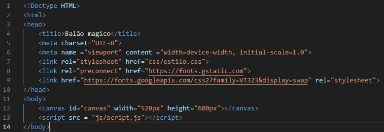

## CSS

No CSS definimos uma borda no centro da tela onde irá aparecer o jogo. Isso o deixa com uma aparência mais refinada e dinâmica para jogar.

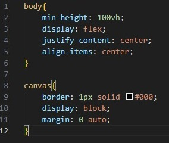

## JavaScript

No JavaScript contém toda a lógica como:

°Movimentação do balão e chão;

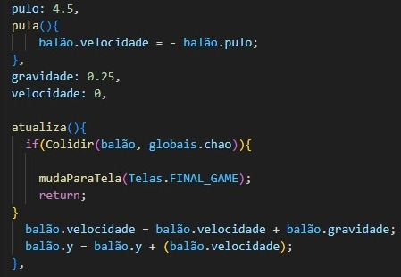
  
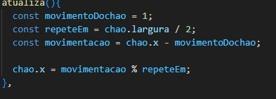

°Detecção de colisões entre o balão, chão e as nuvens;

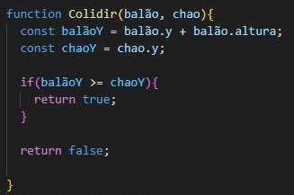

°Controle de Pontuação;

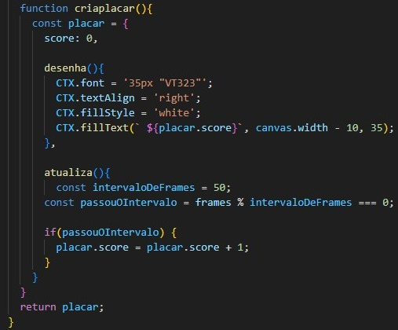

°Mudança na Tela Ativa entre inicio, jogo e final game;

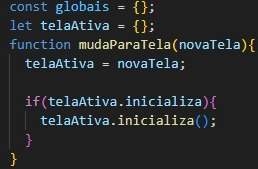
  
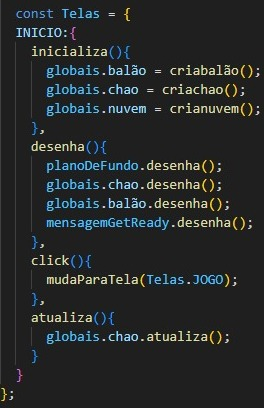
  
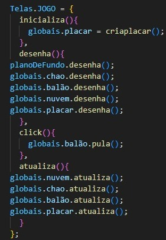
  
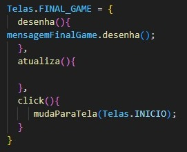

°Os códigos para desenhar os sprites para posicionar no canvas;

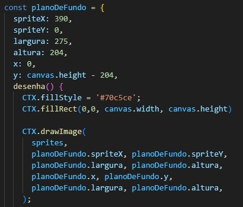

°Funções de loop, click e atualização de frames;

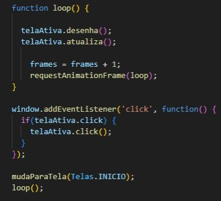

OBS: Esse jogo foi produzido usando como base a música Balão Mágico e o jogo FlappyBird